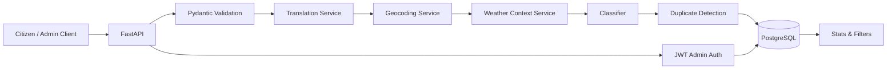

# Citizen Report Triage API

Backend-only FastAPI service for citizen report intake, AI-assisted triage, duplicate detection, admin management, and analytics.

This project is designed for emergency-style public reports that may arrive in fragmented, multilingual, or duplicate form. The backend accepts a report, enriches it with optional external services, classifies the issue, estimates urgency, and stores the result in PostgreSQL for review by responders or administrators.

## Overview

The API is intended to support public-service workflows where speed and structured routing matter more than perfect input quality. It handles:

- Unstructured or incomplete reports
- Bangla and English input
- Issue classification and urgency scoring
- Duplicate detection across recent reports
- Admin status updates and analytics
- External enrichment through translation, geocoding, weather context, and optional Gemini-based classification

## Core Capabilities

- `POST /api/reports` accepts a citizen report and enriches it.
- `GET /api/reports` lists reports with filters such as category, urgency, status, search text, and date range.
- `GET /api/reports/{id}` returns a single report.
- `PATCH /api/reports/{id}/status` lets admins update workflow state.
- `DELETE /api/reports/{id}` removes a report.
- `GET /api/reports/stats/summary` returns totals and breakdowns.
- `POST /api/admin/login` issues a JWT for protected admin actions.

## Data Flow



## Technology Stack

- FastAPI for the HTTP API
- SQLAlchemy for persistence
- PostgreSQL as the required database backend
- Pydantic for validation and response models
- JWT for admin authentication
- Docker Compose for local PostgreSQL and app execution

## Project Structure

```text
app/
  api/routes/        # HTTP routes
  core/              # config, auth, response helpers, rate limit middleware
  db/                # engine/session setup and database seeding
  models/            # SQLAlchemy models
  schemas/           # request and response schemas
  services/          # classification, translation, geocoding, weather, duplicates
  utils/             # helpers such as ID and similarity utilities
tests/               # integration-style API tests
docs/                # architecture notes
```

## Local Setup

### 1. Start PostgreSQL

The project is PostgreSQL-only. Start the database container first:

```bash
docker compose up -d db
```

### 2. Install Dependencies

Use the virtual environment already present in the workspace, or create one if needed:

```bash
pip install -e .[dev]
```

### 3. Configure Environment

Copy the example environment file if you want a local override:

```bash
cp .env.example .env
```

Important variables:

- `DATABASE_URL` - PostgreSQL connection string
- `ADMIN_USERNAME` - seeded admin username
- `ADMIN_PASSWORD` - seeded admin password
- `JWT_SECRET_KEY` - JWT signing secret
- `GEMINI_API_KEY` - optional Gemini API key

### 4. Run the API

```bash
uvicorn app.main:app --reload
```

The server starts on `http://127.0.0.1:8000` by default.

## Example Requests

### Submit a report

```bash
curl -X POST http://127.0.0.1:8000/api/reports \
  -H "Content-Type: application/json" \
  -d '{
    "name": "Rahim",
    "contact": "017xxxxxxxx",
    "location": "Sylhet Bondor Bazar",
    "description": "There is a fire near a shop and people are trapped.",
    "language": "bn"
  }'
```

### Log in as admin

```bash
curl -X POST http://127.0.0.1:8000/api/admin/login \
  -H "Content-Type: application/json" \
  -d '{"username": "admin", "password": "admin123"}'
```

### Update report status

```bash
curl -X PATCH http://127.0.0.1:8000/api/reports/report_123/status \
  -H "Authorization: Bearer <token>" \
  -H "Content-Type: application/json" \
  -d '{"status": "assigned"}'
```

## Response Shape

Successful responses use a consistent envelope:

```json
{
  "success": true,
  "message": "Report submitted successfully.",
  "data": {
    "id": "report_123",
    "category": "fire",
    "urgency": "critical"
  }
}
```

Validation and error responses use the same envelope with `success: false` and, when relevant, a `details` array.

## Database Notes

- PostgreSQL is the required and supported runtime database.
- The app reads `DATABASE_URL` from the environment.
- Local execution is expected to use the PostgreSQL service from `docker compose`.

## External Services

The backend integrates free external APIs in a best-effort way:

- LibreTranslate for Bangla-to-English translation
- Nominatim for geocoding and location enrichment
- Open-Meteo for weather/disaster context
- Gemini for optional AI classification and summary generation

If an external service is unavailable, the API falls back to heuristic logic so report submission still succeeds.

## Testing

Run the test suite with:

```bash
pytest
```

The tests exercise report submission, admin login, status updates, and analytics against PostgreSQL.

## Deployment Notes

- `Dockerfile` builds the API image.
- `docker-compose.yml` starts PostgreSQL and the API together.
- In production, set a strong `JWT_SECRET_KEY` and a real `DATABASE_URL`.

## Troubleshooting

- If the API fails to start, confirm the PostgreSQL container is running and reachable on port `5432`.
- If login fails, check that the seeded admin credentials in your environment match the values in `.env`.
- If external APIs are rate-limited or unavailable, the backend will still process reports using fallback logic.

## Related Files

- [app/main.py](app/main.py)
- [app/core/config.py](app/core/config.py)
- [app/services/report_service.py](app/services/report_service.py)
- [docker-compose.yml](docker-compose.yml)
- [docs/architecture.md](docs/architecture.md)
