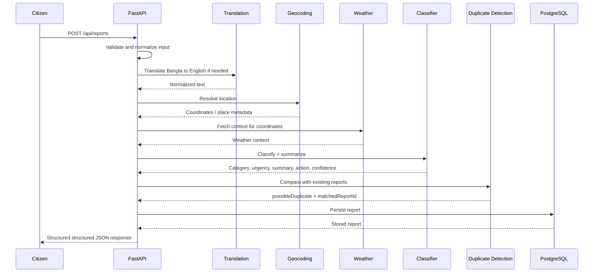

# Architecture Diagram

```mermaid
sequenceDiagram
  participant C as Citizen
  participant A as FastAPI
  participant T as Translation
  participant G as Geocoding
  participant W as Weather
  participant L as Classifier
  participant D as Duplicate Detection
  participant P as PostgreSQL

  C->>A: POST /api/reports
  A->>A: Validate and normalize input
  A->>T: Translate Bangla to English if needed
  T-->>A: Normalized text
  A->>G: Resolve location
  G-->>A: Coordinates / place metadata
  A->>W: Fetch context for coordinates
  W-->>A: Weather context
  A->>L: Classify + summarize
  L-->>A: Category, urgency, summary, action, confidence
  A->>D: Compare with existing reports
  D-->>A: possibleDuplicate + matchedReportId
  A->>P: Persist report
  P-->>A: Stored report
  A-->>C: Structured structured JSON response
```
